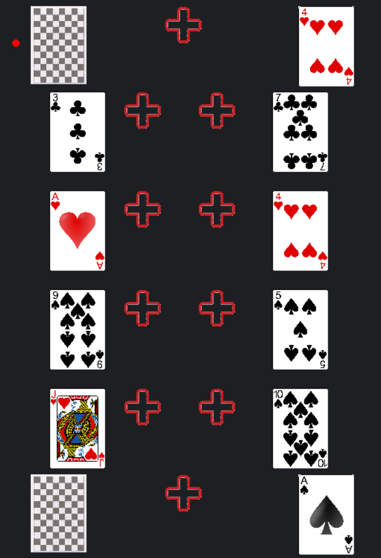
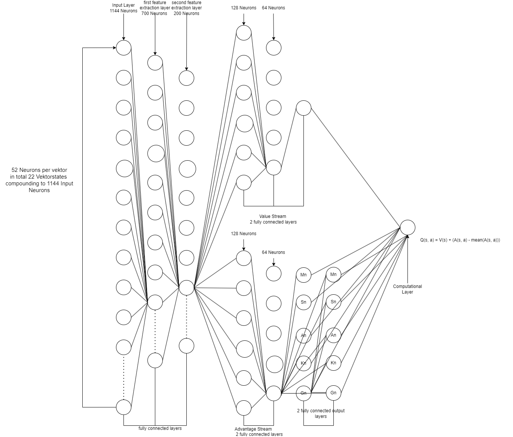

                                                        Das Spiel des Krips

Das Spiel Krips ist eine Patience bei der zwei Spieler gegeneinander spielen. Die bekanntesten Bezeichnungen sind: Zank-Patience(deutsch), Russian Bank(amerikanisch) und Crapette(französisch).
Es ist ein eher unbekanntes Spiel, welches jedoch in meiner Familie seit mind. über einem Jahrhundert gespielt wird.

[Zur Wikipedia Seite zu Krips](https://de.wikipedia.org/wiki/Zank-Patience)

Dieses Repository dient als Darstellung meiner Fähigkeit, die ich in den Informatik-Modulen des ersten und zweiten Semesters des Wirtschaftsinformatik Studiums der TH-Koeln, erlangt habe.
Dieses Projekt ist ein Teil eines größeren Reinforcement-Learning Projektes zur Analyse einer optimalen Spielstrategie. 

Die momentane Zielsetzung ist: (X)= Beendet
- Erstelle ein Spiel, welches in der Konsole spielbar ist.                                        X
- Erstelle eine Graphical User Interface, welches die Konsole in der Ein- und Ausgabe ersetzt.    X
- Erstelle eine Datenhaltung, welche die Spielzüge in einer Schach änhlichen Notation speichert.  X
- Erstelle ein Reeinforcement Dualing-Q Agenten
- Interpretation der Ergebnisse
- Erstelle eine Dokumentation                                                                     ~

Bis jetzt sind die Ersten drei Punkte grob Beendet.

Allgemeine Spielregeln zum Spiel Krips in Kurzform:  
  
Das Ziel des Spiels ist es wie im Solitär Sets zusammenzulegen. Von Ass -> Zwei -> ... -> König.  
Von diesen Sets bilden sich dann insgesamt 8. 2 Pik,2 Coeur usw. Dadurch ergeben sich 8 Felder in der Mitte in einer 4X2 Matrix.
Diese 8 Felder in der Mitte haben absolute Priorität und müssen belegt werden, wenn möglich.  
Wenn diese Regel nicht beachtet wird und der Gegner diesen Fehler bemerkt, wird der Spielzug an den Gegner übergeben.  

Außenrum gibt es 8 Felder. Rechtes und Links eine Vertikale reihe von 4 Feldern, die frei belegt werden können.Zu Beginn des Spiels sind diese Felder jeweils mit einer Karte belegt. 
Diese 8 Plätze können ähnlich wie bei Solitär belegt werden. Von der Wertung absteigend und Schwarz, Rot in der Reihenfolge. So kann ein Anfangszustand aussehen. Die 8 mittleren Haufen sind hier noch leer.

Jeder Spieler hat 3 Haufen an Karten ein Päckchen, einen Ablagehaufen und ein dreizehner Päckchen.   
Bezogen auf das Bild hier, ist der Linke Haufen das Normale Päckchen. Bei Zug beginn, wird dieser Aufgedeckt und wenn möglich irgendwo abgelegt. Dieser Prozess wird so lange wiederholt, bis man die Karte, die man aufgedeckt hat, nicht mehr hinlegen kann.
Dann legt man die Karte auf den Ablagehaufen (mittleren Haufen). Und der rechte Haufen ist das Dreizehner Päckchen.(13 Karten)

Während man die Karten vom Päckchen aufdeckt, kann man die Karten von Dreizehner Päckchen aufdecken und hinlegen. Jedoch darf man die Karten von Dreizehner Päckchen nicht auf den Ablagehaufen legen.  
Diese bleiben dann offen liegen.

Nachdem man seine Karten vom Päckchen auf den Ablagehaufen gelegt. Ist der Gegner dran, und kann auf die oberste Karte des Ablagehaufens Karten ablegen. Es muss die gleiche Art von Karte sein   
und in der Wertung um 1 höher oder niedriger. Im oberen Bild könnte man auf die Pik 7 die Pik 6 geben.

Wenn der Gegner sein Zug beendet hat, kann man die obersten Karten des Ablagehaufens irgendwo hinlegen.

Das Spiel endet, wenn ein Spieler keine Karten mehr hat. Manchmal kann es auch passieren, dass man im Spiel nicht weiter kommt, da im Dreizehner Päckchen wichtige Karten liegen und man die oberste Karte  
nicht ablegen kann. In diesem Fall, gewinnt der Spieler, der sein Dreizehner Päckchen abgelegt hat. Wenn beide Spieler ein Dreizehner Päckchen haben, wird das Spiel als Unentschieden gewertet.
Zusätzlich dazu gibt es kleine zusatzregeln, die das Spiel interessanter machen. Welche jedoch nicht implementiert sind.

![Demo Video] (https://github.com/Super-Vieh/Krips/blob/main/Bilder/demonstrationsdaten/demo_video.mp4)
Ein kleines 3 Minuten Demo Video, wie das Spiel gespielt wird finden im Repository unter dem Pfad: Bilder/demonstrationsdaten/demo.

Die KI welche das Spiel Krips spielt, basiert auf der Deep Dualing Q-Learning Architektur welche in vielen anderen Spielen genutzt wird.
Eine besondere Eigeschaft des Dualing Q-Learning ist dass, das Neuronale Netzwerk die Aktionen und den Zustand seperat bewertet.

In der Abbildung sieht man zuerst 3 voll-vernetzte Neuronen Schichten. Als Eingabe gibt es ca. 1144 Input Neuronen. 
52 für jede Liste. 22*52= 1144. Nach den 3 Schichten(feature extraction layers) spaltet sich das Netzwerk in zwei Teile. 
Das este(obere),schätzt den Wert des Zustandes und hat somit nur ein Output Neuron.
Das zweite Netz, schätzt die Qualität der Aktionen die mann nehmen kann.

Hier kommt eine unkonventionelle Architekur ins Spiel. Anstatt eine Reihe von 12*22 Output Neuron, gibt es zwei Reihen.
Die erste Reihe hat 11 Neuronen die zweite hat 21 Neuronen. Die Kodierung sieht wie folgt aus. 
Output1.  K->0 , S1-S8 ->1-8,A0->9 A1->10 A2->11
Output2.  K->0 ,S1-S8 ->1-8,M1-M8->9-16,A0->18 A1->19 A2->20, G0->21

Am Ende wird für jede Aktion(in diesem Fall für jedes Aktionspaar) in einem Zustand geschätzt wie gut sie ist.

Stand 32.03.2025 
2500 Lines of Code | 160 Stunden Arbeit
