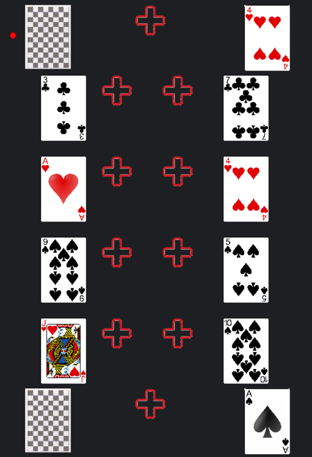
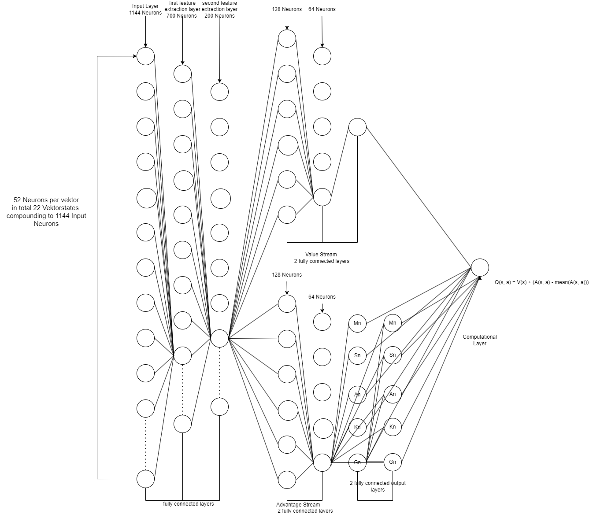

                                                        クリプスゲーム

Kripsゲームは、2人のプレーヤー間でプレイ忍耐ゲームです。最も一般的な名称は以下の通り： Zank-Patience（ドイツ語）、Russian Bank（アメリカ語）、Crapette（フランス語）。 
これはあまり知られていないゲームだが、私の家系では少なくとも1世紀はプレイされてきた。

[クリプスのウィキペディアページへ](https://de.wikipedia.org/wiki/Zank-Patience)

このリポジトリは、私がTH-KölnでWirtschaftsinformatik（経済情報学）の学位を取得した前期と後期の学生であったことの証である。 
これは、最適なゲーム戦略を分析するための、より大きな強化学習プロジェクトの一部です。

現在の目標は次のとおり。
- ゲーム機で遊べるゲームを作る。                                       X
- コンソールの入出力を置き換えるグラフィカル・ユーザー・インターフェイスを作成する。   X
- チェスのような記譜法を作り、ゲームの手順をデータベースに記録する。 X
- 強化デュアルQエージェントの作成 X
- 結果の解釈
- ドキュメンテーションを作成する。

  
クリプスゲームの一般ルール(概要):.  
  
ゲームの目的は、ソリティアのようにセットを組み合わせることである。 
エース→2→...→キング。 
  
これらのセットから合計8つのセットが形成される：2ピク、2クールなど。 
これにより、4X2のマトリックスとして中央に8つのフィールドができる。 
この中央の8つのフィールドには絶対的な優先順位があり、できるだけ埋めなければならない。 
このルールが守られず、相手がミスに気づいた場合、そのターンは相手に回ってくる。 

外側には8つのフィールドがある。左右には縦に並んだ4つのマスがあり、空きがあれば自由に埋めることができる。 
ゲーム開始時には、これらの場はそれぞれカードで埋められている。 
この8つの場は、ソリティアのように数字の降順と黒、赤の順に埋めることができる。 
これは初期状態の例である。中央の8つの山はここではn[...]である。 

各プレイヤーは3つのカードの山を持っている：通常のノーマルパッケージ、テイクオフパッケージ、13パッケージ（13枚のカードを持っているから）。 
図の左側の山が通常のパッケージです。ターンの始めに、このカードは表向きにされ、可能な場所に置かれる。 
この作業を，移動が不可能になるまで繰り返す．
その後、カードはテイクオフ・パッケージ(中央の パッケージ)の上に置かれる。 
右側の山が 13 パッケージとなる。(13 カルテン）

パケットチェンのカードは表向きにされ、13 パッケージのカードも表向きにされる。
しかし，「13 パッケージ」のカードは，「13 パッケージ」の上に置くことはできない[...]． 
オープン状態のままである．

ノーマルパッケージのカードをテイクオフパッケージの上に置 いた後、対戦相手のターンとなり、対戦相手はテイクオフパッケージの上 のカードの上にカードを置くことができます。 
その場合、そのカードは同じ種類で、1 つ高いか低いカードでなければな りません。 
上の図では、ピック 7 の上にピック 6 を置くことが可能である。

相手が手番を終えたら、テイクオフ・パッケージの一番上のカードを任意の場所に置くことができます。

どちらかのプレイヤーの手札がなくなるか、ド ライズナー・ペッヘンに重要なカードがなくなり、一番上のカード を置くことができなくなったとき、ゲームは終了する。 
その場合、13Packageを置いたプレイヤーの勝ちとなる。 
両方のプレイヤーが13Packageを持っている場合、ゲームは引き分けとなる。 
さらに、ゲームを面白くするための小さな追加ルールがありますが、これらは実装されていません。

![Demo Video] (https://github.com/Super-Vieh/Krips/blob/main/Bilder/demonstrationsdaten/demo_video.mp4)
リポジトリには、以下のパスにゲームの遊び方を紹介する約3分のデモビデオがあります： Bilder/demonstrationsdaten/demo.

KripsゲームをプレイするAIは、他の多くのゲームで使われているDeep Dualing Q-Learning Architekturに基づいています。 
Dualing Q-Learningの特徴の一つは、Neuronale NetzwerkがAktionenとZustandを別々に評価することである。

図では、まず3つの完全連結ニューロン層が示されている。 
入力として約1144個の入力ニューロンがある。 
各リストには52個あり、22 x 52 = 1144である。 
3層（特徴抽出層）の後、ネットワークは2つに分割される。 
上側（este）は状態値を推定し、出力ニューロンは1つだけである。 
下側のネットワークは、取るべきアクショネンの質を推定する。

ここで、従来とは異なるArchitekurが登場する。 
12×22の出力ニューロンの代わりに、2つの列に分かれている。 
最初の列には11個のニューロンがあり、2番目の列には21個のニューロンがある。 
アクションのエンコーディングは以下の通り。 
出力1。k -> 0 , s1-s8 -> 1-8, a0 -> 9, a1 -> 10, a2 -> 11  
出力2. k -> 0 , s1-s8 -> 1-8, m1-m8 -> 9-16, a0 -> 18, a1 -> 19, a2 -> 20, g0 -> 21

最後に、各アクション（この場合は各アクションペア）について、その状態での良さを推定する。
